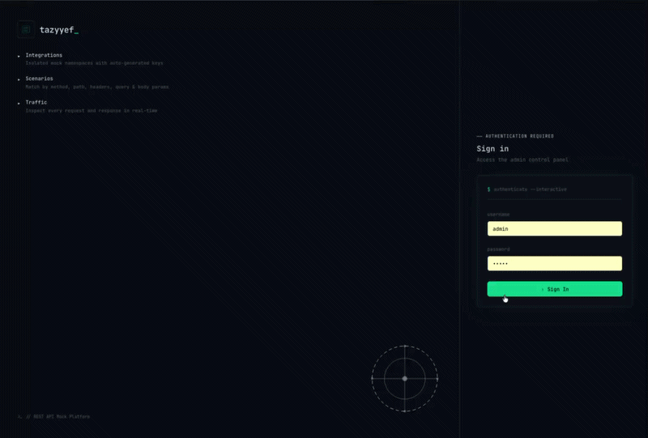

# Tazyyef 

API Mocking

> **Notice:** This project was written entirely by AI.

A full-stack API mocking application with a React admin panel, Redis-backed storage, intelligent scenario matching, and Postman collection import support.



## Purpose

API Mock is designed to simulate REST API integrations so you can develop, test, and debug your applications without relying on real external services. By creating mock integrations and defining multiple response scenarios, you can:

- **Run tests reliably** — Eliminate flakiness caused by unavailable or unpredictable third-party APIs.
- **Create different scenarios** — Model success responses, edge cases, and error states on demand.
- **Speed up development** — Work in parallel even when the real API is not yet ready or rate-limited.
- **Inspect traffic** — Capture and review every request and response to understand how your app interacts with the mock service.

## Features

### Core Mocking Engine

- **Intelligent Scenario Matching** — Matches incoming requests to the most specific scenario based on method, endpoint path, headers, query parameters, and body parameters. A scenario is eligible only when **all** its defined criteria are satisfied, and the one with the most criteria wins.
- **Dynamic Mock API Endpoint** — Exposes a public `/mock/:integrationKey/*` route that resolves the correct integration and returns the configured mock response.
- **Flexible Response Configuration** — Define mock response bodies (JSON), HTTP status codes, and custom headers per scenario.

### Integration & Scenario Management

- **Integration CRUD** — Create, read, update, and delete mock API integrations. Each integration receives an auto-generated unique key (e.g., `payment-gateway`).
- **Scenario CRUD** — Define, edit, and delete mock scenarios per integration. Scenarios support matching on HTTP method, endpoint path, headers, query parameters, and body parameters.
- **Scenario Detail Page** — View a scenario's full configuration and its associated traffic history.
- **Built-in Scenario Testing** — In-app test panel to fire HTTP requests against a scenario and inspect the returned response in real time.

### Postman Collection Import

- **Postman v2 Collection Import** — Paste a Postman Collection v2 JSON to preview endpoints before importing.
- **Conflict Detection** — Detects existing scenarios and endpoints that would conflict with the imported collection.
- **Granular Import Control** — Choose per-endpoint whether to skip, create new, or overwrite existing scenarios.

### Traffic Logging & Observability

- **Automatic Traffic Capture** — All mock API requests and responses are logged automatically via middleware, including method, path, headers, query, body, status code, and response time.
- **Matched Scenario Tracking** — Each traffic log entry records which scenario was matched for the request.
- **TTL-based Auto-Expiry** — Traffic logs expire automatically after a configurable number of days (`TRAFFIC_LOG_TTL_DAYS`, default 7).
- **Filterable Traffic Logs** — View traffic logs globally or filter by a specific integration in the admin panel.
- **Traffic Log Management** — View individual traffic entries and clear all logs from the admin UI.

### Admin Panel (React SPA)

- **Modern React 19 SPA** — Built with Vite for fast builds and HMR, using Tailwind CSS for styling.
- **TanStack Router** — File-based/client-side routing with a sidebar navigation layout.
- **TanStack Query** — Server state management with caching, background refetching, and optimistic updates.
- **Radix UI Primitives** — Accessible, unstyled UI building blocks (dialog, select, tabs, table, etc.).
- **React Hook Form + Zod** — Robust form handling with real-time validation schemas across the admin panel.
- **Toast Notifications** — User feedback via `sonner` toasts for success, error, and info states.
- **Error Boundaries** — React error boundaries prevent the entire admin panel from crashing on component errors.
- **Responsive Layout** — Sidebar-based app shell with a clean, modern interface.
- **Axios API Client** — Centralized HTTP client for all admin API communication.

### Authentication & Security

- **Environment-based Authentication** — Admin credentials (`ADMIN_USER` and `ADMIN_PASS`) are configured via environment variables, making it easy to change without touching code. Passwords are bcrypt-hashed at runtime.
- **Redis-backed Session Store** — Sessions are stored in Redis for scalability and shared state across server restarts.
- **Auth State Hook** — Centralized `useAuth` hook manages login state, logout, and route guards in the React app.
- **Protected Admin Routes** — All `/api/admin/*` endpoints require a valid session cookie.

### Rate Limiting

- **Global Mock API Rate Limiting** — Configurable global rate limit on all `/mock/*` requests.
- **Per-Scenario Rate Limiting** — Individual scenarios can define their own rate limits and time windows, backed by Redis.

### Health & Operations

- **Health Check Endpoint** — `GET /health` returns the application status and verifies Redis connectivity.
- **HTTP Request Logging** — Morgan-based HTTP request logging to the console.
- **Express Error Handling** — Centralized 404 and 500 error handlers with JSON responses.
- **Body Parsing** — Supports JSON and URL-encoded request bodies up to 50MB.

### Development & Deployment

- **Development Mode** — `npm run dev` starts the server with nodemon auto-reload and Vite HMR for the admin panel.
- **Production Mode** — `npm start` serves the built admin SPA as static files with SPA fallback routing.
- **Docker Support** — Multi-stage `Dockerfile` for optimized production builds.
- **CI/CD Pipeline** — GitHub Actions workflow runs the test suite across Node.js versions 18, 20, and 22.

## Project Structure

```
tazyyef/
├── admin/                          # React SPA (Vite + Tailwind)
│   ├── components/                 #   UI components
│   │   ├── Integrations/           #     Integration list, detail, forms
│   │   ├── Scenarios/              #     Scenario list, detail, forms
│   │   ├── Traffic/                #     Traffic log viewer
│   │   ├── ui/                     #     Shared primitives (dialog, select, etc.)
│   │   ├── Layout.jsx              #     App shell with sidebar navigation
│   │   ├── LoginScreen.jsx         #     Login form
│   │   ├── PostmanImportModal.jsx  #     Postman collection import UI
│   │   ├── TestModal.jsx           #     Scenario testing panel
│   │   ├── ConfirmDialog.jsx       #     Confirmation dialog
│   │   └── ErrorBoundary.jsx       #     React error boundary
│   ├── hooks/useAuth.js            #   Auth state hook
│   ├── lib/api.js                  #   API client (axios)
│   ├── lib/utils.js                #   Utility helpers
│   ├── routes/index.jsx            #   TanStack Router configuration
│   ├── schemas/                    #   Zod validation schemas
│   ├── dist/                       #   Production build output
│   ├── index.html
│   └── main.jsx                    #   React entry point
├── public/                         # Static assets (favicon, logo)
├── src/
│   ├── config/
│   │   ├── env.js                  # Environment variable loader
│   │   ├── redis.js                # Redis client setup (ioredis)
│   │   └── sessionStore.js         # Redis-backed session store
│   ├── controllers/
│   │   ├── authController.js
│   │   ├── importController.js     # Postman import handler
│   │   ├── integrationController.js
│   │   ├── mockController.js
│   │   ├── scenarioController.js
│   │   └── trafficController.js
│   ├── middleware/
│   │   ├── auth.js                 # Session authentication guard
│   │   ├── logger.js               # HTTP request logging (Morgan)
│   │   ├── rateLimiter.js          # Rate limiting (global + per-scenario)
│   │   ├── trafficLogger.js        # Automatic traffic capture
│   │   └── validator.js            # JSON field validation (Zod)
│   ├── models/
│   │   ├── Integration.js          # Integration data model (Redis)
│   │   ├── Scenario.js             # Scenario data model (Redis)
│   │   └── Traffic.js              # Traffic log data model (Redis)
│   ├── routes/
│   │   ├── auth.js
│   │   ├── integrations.js         # Integrations + Postman import routes
│   │   ├── mock.js                 # Public mock API endpoint
│   │   ├── scenarios.js
│   │   └── traffic.js
│   ├── services/
│   │   ├── authService.js
│   │   ├── integrationService.js
│   │   ├── mockService.js          # Scenario matching engine
│   │   ├── postmanImportService.js # Postman collection parser
│   │   ├── scenarioService.js
│   │   └── trafficService.js
│   └── app.js                      # Express entry point
├── tests/unit/
│   ├── authService.test.js
│   ├── mockService.test.js
│   └── postmanImportService.test.js
├── .env                            # Environment variables (committed for dev)
├── .github/workflows/test.yml      # CI: test matrix (18, 20, 22)
├── Dockerfile                      # Multi-stage production build
├── jest.config.js
├── nodemon.json                    # Dev auto-reload config
├── vite.config.js                  # Vite config for admin SPA
├── tailwind.config.cjs
└── postcss.config.cjs
```

## Prerequisites

- **Node.js** >= 18
- **Redis** >= 5 — A running Redis server is **required**. The app stores all data (integrations, scenarios, sessions, and traffic logs) in Redis.

## Setup

1. **Clone and install dependencies:**

```bash
cd tazyyef
npm install
```

2. **Configure environment:**

Edit `.env` with your settings. All variables have sensible defaults for development, but **bold** ones should be explicitly set in production:

```env
ADMIN_USER=admin
ADMIN_PASS=admin
SESSION_SECRET=change-this-to-a-random-string
```

| Variable | Required | Default | Description |
|----------|----------|---------|-------------|
| `ADMIN_USER` | **Yes** | `admin` | Admin username for the web panel login. |
| `ADMIN_PASS` | **Yes** | `admin` | Admin password for the web panel login. |
| `SESSION_SECRET` | **Yes** | `change-this-to-a-random-string` | Secret key used to sign session cookies. **Must be changed in production.** |
| `PORT` | No | `3000` | HTTP port the Express server listens on. |
| `REDIS_URL` | **Yes** | `redis://localhost:6379` | Redis connection URL. **Redis is required** — the app will not start without it. |
| `MOCK_RATE_LIMIT` | No | `100` | Max requests allowed per IP on the mock API within the window. |
| `MOCK_RATE_WINDOW_MS` | No | `60000` | Time window (ms) for the global mock API rate limit. |
| `DEFAULT_SCENARIO_RATE_LIMIT` | No | `50` | Default max requests per IP for individual scenarios (when not overridden). |
| `DEFAULT_SCENARIO_RATE_WINDOW_MS` | No | `60000` | Default time window (ms) for per-scenario rate limits. |
| `TRAFFIC_LOG_TTL_DAYS` | No | `7` | Number of days before traffic log entries auto-expire from Redis. |

3. **Build the admin panel:**

```bash
npm run build:admin
```

4. **Start Redis** (if not already running):

```bash
redis-server
```

5. **Run the application:**

```bash
# Production
npm start

# Development (with auto-reload via nodemon + Vite HMR)
npm run dev
```

The server starts at `http://localhost:3000`.

### Docker

```bash
docker build -t tazyyef .
docker run -p 3000:3000 --env-file .env tazyyef
```

## Usage

### Admin Panel

Navigate to `http://localhost:3000` and log in with the credentials from `.env`.

1. **Create an Integration** — Give it a name; a unique key is auto-generated (e.g., `mock-a1b2c3d4`)
2. **Add Scenarios** — Define endpoint, method, matching conditions (headers, query params, body params), and the mock response body + status code
3. **Import from Postman** — Paste a Postman v2 collection JSON to preview and selectively import endpoints
4. **View Traffic Logs** — Monitor all mock API requests and responses; each log entry shows the matched scenario
5. **Test Scenarios** — Use the built-in test panel to send requests and inspect responses

### Mock API

External clients call the mock API using the integration key:

```
http://localhost:3000/mock/{integration_key}/path/to/endpoint
```

**Example:**

```bash
# Assuming integration key is "mock-a1b2c3d4" and a scenario exists for GET /users
curl http://localhost:3000/mock/mock-a1b2c3d4/users
```

### Scenario Matching Logic

When a request arrives, the system:

1. Looks up the integration by its key
2. Filters scenarios by exact **method** and **endpoint** match
3. For each candidate, checks that **all** defined match criteria (headers, query params, body params) are satisfied
4. Among eligible scenarios, returns the one with the **most match criteria** (most specific)
5. Returns `404` if no scenario matches

### Health Check

```bash
curl http://localhost:3000/health
# {"status":"ok","timestamp":"2026-05-21T..."}
```

### Admin API Endpoints

All admin endpoints require authentication (session cookie).

| Method | Path | Description |
|--------|------|-------------|
| POST | `/api/admin/auth/login` | Login with `{ username, password }` |
| POST | `/api/admin/auth/logout` | Logout |
| GET | `/api/admin/auth/me` | Check auth status |
| POST | `/api/admin/integrations` | Create integration `{ name, description }` |
| GET | `/api/admin/integrations` | List all integrations |
| GET | `/api/admin/integrations/:id` | Get integration by ID |
| PUT | `/api/admin/integrations/:id` | Update integration |
| DELETE | `/api/admin/integrations/:id` | Delete integration (and its scenarios) |
| POST | `/api/admin/integrations/:id/scenarios` | Create scenario |
| GET | `/api/admin/integrations/:id/scenarios` | List scenarios for integration |
| GET | `/api/admin/scenarios/:id` | Get scenario by ID |
| PUT | `/api/admin/scenarios/:id` | Update scenario |
| DELETE | `/api/admin/scenarios/:id` | Delete scenario |
| POST | `/api/admin/integrations/:id/import/preview` | Preview Postman collection import |
| POST | `/api/admin/integrations/:id/import/confirm` | Confirm and execute import |
| GET | `/api/admin/traffic` | List traffic logs |
| GET | `/api/admin/traffic/:id` | Get traffic log entry |
| DELETE | `/api/admin/traffic/:id` | Delete traffic log entry |
| DELETE | `/api/admin/traffic` | Clear all traffic logs |
| GET | `/api/admin/scenarios/:id/traffic` | Traffic history for a scenario |

## Testing

```bash
npm test                # Run test suite
npm run test:watch      # Watch mode
npm run test:coverage   # With coverage report
```

## Redis Persistence

Data is stored in Redis and persists across app restarts as long as Redis itself persists. Configure Redis persistence (RDB snapshots or AOF) in your `redis.conf` for durability. Traffic logs have a configurable TTL (`TRAFFIC_LOG_TTL_DAYS`, default 7 days).

## License

MIT
